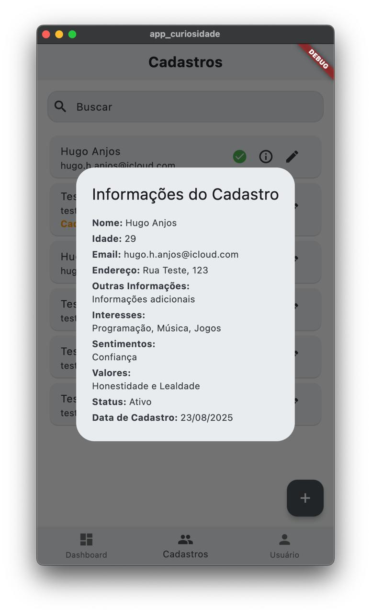

# app_curiosidade

Aplicativo mobile feito com Flutter para o projeto Operação Curiosidade.
A aplicação conta com telas de login e cadastro, dashboard, listagem e cadastro/edição de pessoas.

Foram utilizados as dependências:

  flutter_bloc: ^9.1.1
  dio: ^5.9.0
  get_it: ^8.2.0
  equatable: ^2.0.7

- `flutter_bloc` - Para gerência de estado
- `dio` - Para as requisições de rede (chamadas de API)
- `get_it` - Para injeção de dependências
- `equatable` - Para comparações dos estados e eventos do BLoC, para melhor controle de rebuilds de tela

## Requisitos

A versão do Flutter utilizada foi a stable atual (Ago/2025, 3.35.1). Recomenda-se o uso do `fvm` para controle de versões do Flutter. Para rodar, basta instalar as dependências com:

```sh
flutter pub get
```

Também é necessário adicionar o endereço correto da [API curiosidades](https://github.com/hugoanjos/api-curiosidade) no arquivo `app_config.dart` dentro da pasta `lib/core/config`.

## Estrutura do Projeto

- `lib/` - Código principal do app
- `features/` - Funcionalidades separadas por módulo
- `core/` - Configuração de dependências e autenticação
- `shared/` - Componentes reutilizáveis
- `screenshots/` - Imagens do app

## Screenshots

Login:


Dashboard:


Listagem de Pessoas:


Informações do Cadastro:


Gerenciar Usuário:


